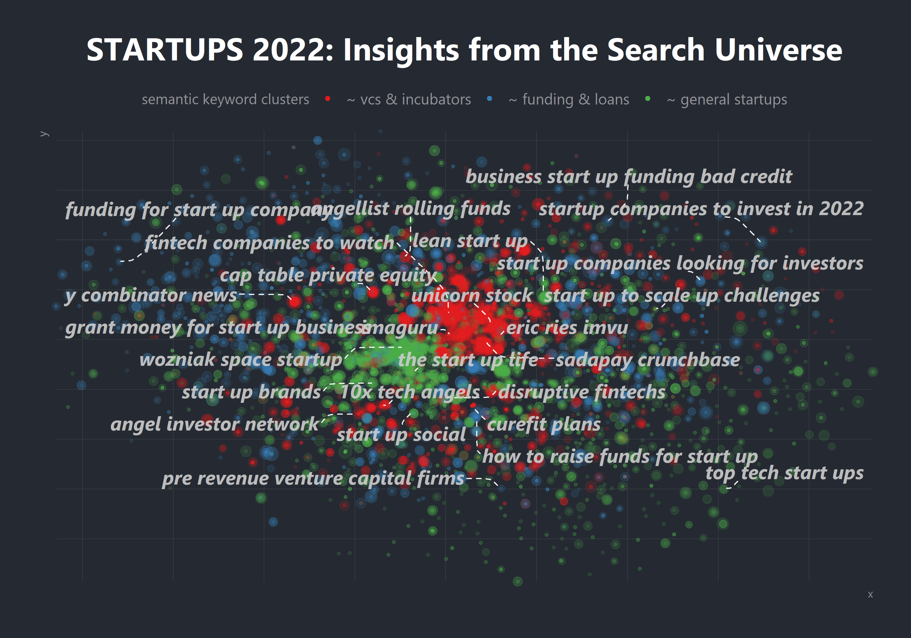

Startups 2022: Search Intelligence Insights

2021 was a record breaking year for the startup economy.

IPOs, venture capital and number of new unicorns created hit record numbers. And it's not just in the USA. Europe and MENA regions had an exceptional 2021 too. UK, Israel (impressive!), Switzerland, Greece (finally), UAE but also Brazil, Canada, Australia and S.Korea.

Moreover new types of startups have emerged in areas ranging from cleantech, proptech, spacetech to web3.

What's next for startups?

I 've looked at it through the perspective of search interest on Google, since increased search activity is often a leading indicator for things to come.

The analysis is based on a search universe generated by collecting search data at a large scale It highlights the various fast growing trends and rising stars in the most interesting part of this universe.

**About the Data**

-   Data from the analysis come from Google via the Google ads API

-   Suggestions were collected using various tools including Google Trends, Google ads, SEMrush and others

-   You can find more information about the process of accessing the data via this post by Daniel Heredia: <https://www.danielherediamejias.com/python-keyword-planner-google-ads-api/>

-   The data collected for the startups project is available in this repo in a reduced size format format. Follow the code to convert to csv (it's over 100MB and couldn't be included in this github repo)

-   time series data in csv now is available: <https://drive.google.com/file/d/1JtdLuuVEY3zrmpfpjn3NnNdjTarc405D/view?usp=sharing>

**About the Analysis**

-   Linear models are used to identify keywords which exhibit a consistent growth over the course of the last 4 years - in net numbers and relative growth too.
-   The data used for the visualisation are 3-month rolling averages to smoothen the time series
-   Note that monthly search volumes are rounded approximations as this is how Google provides the data
-   Note that the analysis is exploratory, it doesn't intend to make any statistical inferences, it's more like the trigger of the discussion.

**Files contained in the repo**

-   Seeds.csv contains a list of \~700 seed keywords. For each ones of these multiple related keywords were retried via the Google ads API

-   Startup search data: data file in rds format - see data section above for a copy in csv format available online

-   startups-2022-analytics.md contains the code and output from the .Rmd with the same name

-   gg-functions: helper functions for the visualisations

-   renv.lock: list of R packages and versions to reproduce the analysis
