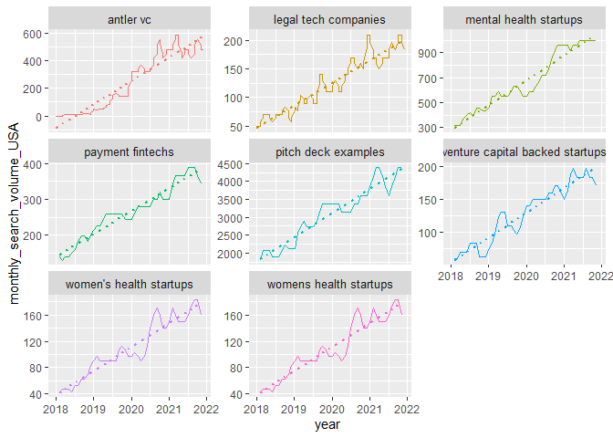

Search trends analysis
================
Alex Papageorgiou
1/27/2022

# Setup

# Data

``` r
search_data <- read_rds("startup_search_data.rds")


search_data %>% sample_n(20)
```

    ## # A tibble: 20 x 5
    ##    kw_id keyword                       seed    avg_monthly_sea~ searches_past_m~
    ##    <int> <chr>                         <chr>              <dbl> <list>          
    ##  1 36997 find angel investors near me  find a~               20 <int [48]>      
    ##  2 29392 best low start up businesses  best s~               20 <int [48]>      
    ##  3 27052 deep technology startups      tech s~               10 <int [48]>      
    ##  4 31955 seed angel                    angel ~               90 <int [48]>      
    ##  5 21999 start up loans for women      startu~               30 <int [48]>      
    ##  6  7609 best startups to work         work a~               10 <int [48]>      
    ##  7 26460 5 minute pitch deck           startu~               20 <int [48]>      
    ##  8 10894 grants for fintech startups   busine~               10 <int [48]>      
    ##  9  9296 the seed stage                seed s~               10 <int [48]>      
    ## 10 31447 any startup idea              start ~               10 <int [48]>      
    ## 11 23450 best startup ideas 2022       startu~               10 <int [48]>      
    ## 12 31071 startup ideas for it students start ~               10 <int [48]>      
    ## 13  2136 ksidc seed fund               seed f~               10 <int [48]>      
    ## 14 47852 tech startup financial model  start ~               10 <int [48]>      
    ## 15 15748 unicorn investment meaning    unicor~               10 <int [48]>      
    ## 16 56987 algolia startup               startu~               10 <int [48]>      
    ## 17 13457 best media startups           top st~               10 <int [48]>      
    ## 18 37652 firehouse subs start up cost  busine~               10 <int [48]>      
    ## 19  3640 atomic fintech                fintec~              110 <int [48]>      
    ## 20 36051 online store startup costs    start ~               10 <int [48]>

# STATS

## Add months columns

``` r
months_df <- tibble(month = ymd("2018-01-01") + months(0:47))


sd_long <- search_data %>% unnest_longer(searches_past_months)


sd_monthly <- sd_long %>%
  mutate(
    month = rep(months_df$month, len = nrow(sd_long)),
    month_counter = rep(1:48, len = nrow(sd_long))
  ) %>%
  mutate(year = year(month) + yday(month) / 365) %>%
  select(Keyword = keyword, seed, searches_past_months, avg_monthly_searches, month_counter, month, year)
```

## data to csv

``` r
# sd_monthly %>%
#   select(keyword = Keyword, seed, month, search_volume = searches_past_months) %>%
#   write_csv("startup_search_data.csv")
```

## 3m Rolling avg

``` r
sd_month_filt <- sd_monthly %>%
  group_by(Keyword) %>%
  arrange(desc(year)) %>%
  dplyr::filter(max(searches_past_months) > 30) %>%
  ungroup()

rolling <- sd_month_filt %>%
  group_by(Keyword) %>%
  mutate(n = n()) %>%
  arrange(year) %>%
  mutate(roll_avg = zoo::rollmean(searches_past_months, 3, fill = NA)) %>%
  mutate(roll_avg_round = round(roll_avg, digits = 0)) %>%
  ungroup()
```

## Lms

to estimate avg monthly change

``` r
models <- rolling %>% # mutate(search_volume =ifelse(search_volume <100, NA , search_volume) )
  group_by(Keyword) %>%
  # dplyr::filter(cumany(searches_past_months>0)) %>%
  nest() %>%
  mutate(model = map(data, function(df) lm(roll_avg_round ~ month_counter, data = df))) %>%
  mutate(
    by_term = map(model, broom::tidy),
    perf = map(model, broom::glance)
  )

# anti <- rolling %>% anti_join(models, by=c('Keyword', "searches_past_months"))

by_term <- models %>%
  unnest(by_term) %>%
  select(Keyword, term, estimate)

perf <- models %>%
  unnest(perf) %>%
  select(Keyword, r.squared)


by_term_perf <- by_term %>%
  left_join(perf, by = "Keyword") %>%
  arrange(desc(r.squared)) %>%
  dplyr::filter(term == "month_counter")


kw_rsq_vol <- by_term_perf %>%
  left_join(search_data %>% select(Keyword = keyword, avg_monthly_searches)) %>%
  relocate(avg_monthly_searches, .after = Keyword) %>%
  mutate(estimate = round(estimate, digits = 2))
```

    ## Joining, by = "Keyword"

## Natural log model

to estimate growth rate

``` r
model_ln <- rolling %>% # mutate(search_volume =ifelse(search_volume <100, NA , search_volume) )
  dplyr::filter(roll_avg_round > 0) %>%
  group_by(Keyword) %>%
  nest() %>%
  mutate(model = map(data, function(df) lm(log(roll_avg_round) ~ month_counter, data = df))) %>%
  mutate(
    by_term_ln = map(model, broom::tidy),
    perf_ln = map(model, broom::glance)
  )
```

    ## Warning in summary.lm(x): essentially perfect fit: summary may be unreliable

    ## Warning in summary.lm(x): essentially perfect fit: summary may be unreliable

    ## Warning in summary.lm(x): essentially perfect fit: summary may be unreliable

``` r
by_term_ln <- model_ln %>%
  unnest(by_term_ln) %>%
  select(Keyword, term, estimate)
perf_ln <- model_ln %>%
  unnest(perf_ln) %>%
  select(Keyword, r.squared)

by_term_perf_ln <- by_term_ln %>%
  left_join(perf_ln, by = "Keyword") %>%
  arrange(desc(r.squared)) %>%
  dplyr::filter(term == "month_counter") %>%
  select(Keyword, rsq_log = r.squared, pct_log = estimate)
```

## Peaked

when the trend had a peaked and then went downwards

``` r
peaked <- rolling %>%
  dplyr::filter(roll_avg_round > 0) %>%
  group_by(Keyword) %>%
  mutate(
    max = max(roll_avg_round),
    rmavg = mean(roll_avg_round),
    max_year = max(year),
    min_year = min(year)
  ) %>%
  slice_max(roll_avg_round, n = 1) %>%
  slice_head(n = 1) %>%
  ungroup() %>%
  mutate(ratio = rmavg / max) %>%
  # dplyr::filter(year != min_year, year != max_year) %>%
  select(Keyword, ratio)
```

## JOIN all

``` r
# by_term_perf_ln
all_data <- kw_rsq_vol %>%
  left_join(by_term_perf_ln) %>%
  left_join(peaked) %>%
  # dplyr::filter(is.finite(r.squared), !is.na(estimate)) %>%
  dplyr::filter(if_all(c(avg_monthly_searches, estimate, r.squared, rsq_log, pct_log, ratio), ~ is.finite(.x))) %>%
  mutate(
    estimate = round(estimate),
    r.squared = round(r.squared, digits = 1),
    rsq_log = round(rsq_log, digits = 1),
    pct_log = round(pct_log, digits = 1),
    ratio = round(ratio, digits = 1)
  )
```

    ## Joining, by = "Keyword"
    ## Joining, by = "Keyword"

## save

``` r
# write_rds(rolling, "rolling.rds")
# write_csv(all_data, "kw_rsq_vol.csv")
```

## visualise

keywords with best R squared and positive coeffiecient values ie search
queries with consistent and positive pattern of growth

``` r
selection <- all_data %>%
  ungroup() %>%
  dplyr::filter(avg_monthly_searches > 100, estimate > 0) %>%
  slice_max(order_by = r.squared, n = 9, with_ties = FALSE) %>%
  pull(Keyword)

rolling %>%
  dplyr::filter(Keyword %in% selection) %>%
  ggplot(aes(x = year, y = roll_avg_round, colour = Keyword)) +
  geom_line() +
  facet_wrap(~Keyword, nrow = 3, scales = "free_y") +
  geom_smooth(method = "lm", se = F, linetype = 3, alpha = 0.3) +
  expand_limits(y = NULL) +
  theme(legend.position = "none", strip.text = element_text(size = 10)) +
  ylab("monthly_search_volume_USA")
```

    ## `geom_smooth()` using formula 'y ~ x'

    ## Warning: Removed 16 rows containing non-finite values (stat_smooth).

    ## Warning: Removed 16 row(s) containing missing values (geom_path).

<!-- -->

## style plot for publication

``` r
rolling %>%
  dplyr::filter(Keyword %in% selection) %>% 
  plot_by_category(my_title ="", my_subtitle = "", time_col = "year")
```

    ## `geom_smooth()` using formula 'y ~ x'

    ## Warning: Removed 16 rows containing non-finite values (stat_smooth).

    ## Warning: Removed 16 row(s) containing missing values (geom_path).

<!-- -->
